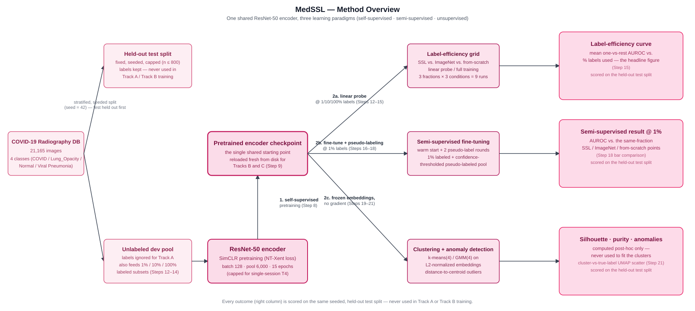
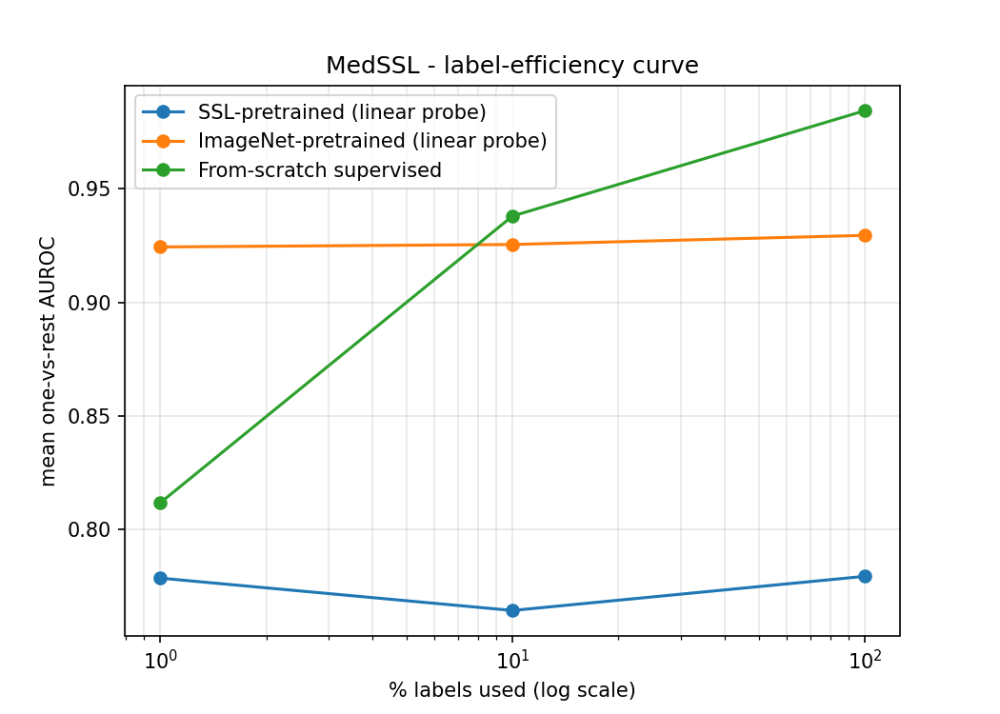
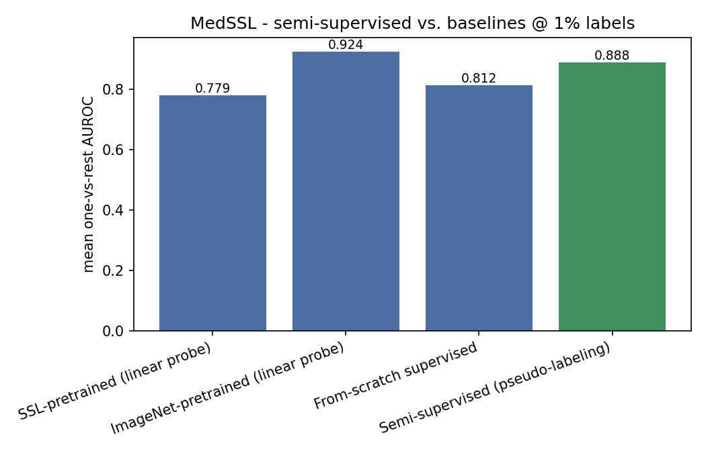
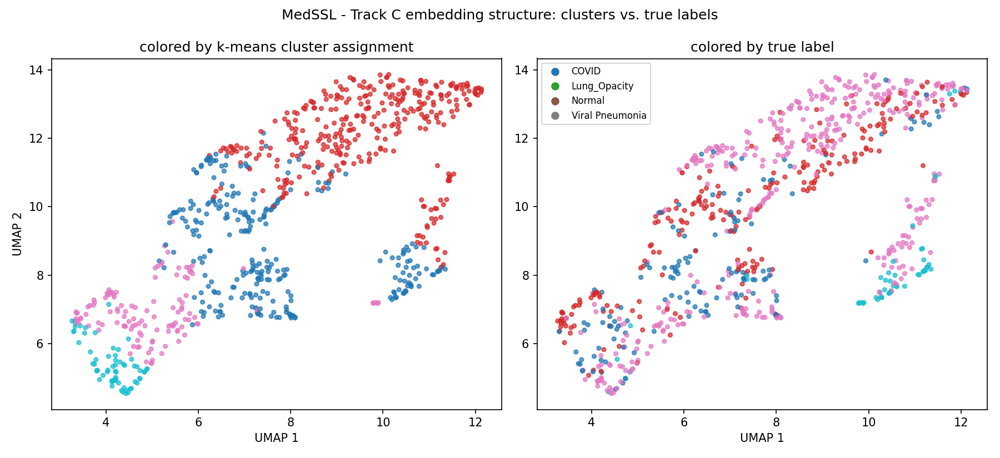
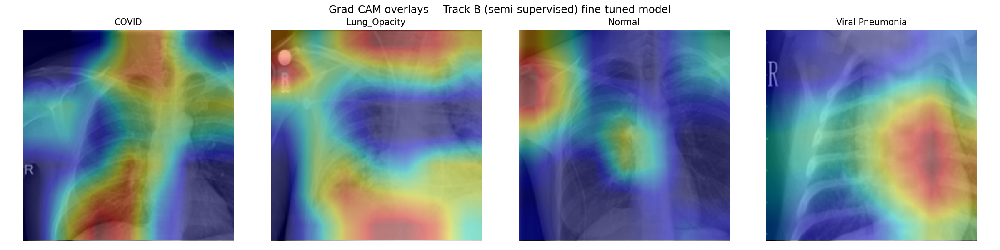

# MedSSL

### Representation Learning for Chest X-Rays Under Label Scarcity

Self-supervised, semi-supervised, and unsupervised representation learning with a shared ResNet-50 encoder.

[](https://www.python.org/)
[](https://pytorch.org/)
[](https://www.kaggle.com/datasets/tawsifurrahman/covid19-radiography-database)
[](LICENSE)

> A compact research implementation studying how self-supervised and semi-supervised learning affect representation quality and downstream performance when labeled medical images are scarce.

---

## Overview

Labeled medical images are expensive to obtain, while unlabeled images are comparatively abundant. This creates a central question for medical computer vision:

> **How much can representation learning improve downstream performance when only a small fraction of the available images are labeled?**

MedSSL investigates this question using chest X-rays and a shared **ResNet-50 encoder** across three complementary learning paradigms:

- **Self-supervised learning:** SimCLR pretraining using unlabeled chest X-rays.
- **Semi-supervised learning:** confidence-thresholded pseudo-labeling using a small labeled subset together with the remaining unlabeled images.
- **Unsupervised learning:** clustering and anomaly analysis of frozen self-supervised embeddings.

The three tracks use the same held-out test set and follow a controlled evaluation protocol.

---

## Research Question

The project evaluates whether in-domain self-supervised representation learning provides a measurable advantage over generic ImageNet pretraining and conventional supervised training when labeled data are limited.

The comparison is performed at multiple labeled-data budgets while keeping the encoder architecture and downstream evaluation protocol fixed.

### Core comparison




---

## Experimental Design

### Track A — Self-Supervised Learning

SimCLR is used to pretrain a ResNet-50 encoder on unlabeled chest X-rays.

Key characteristics:

- ResNet-50 trained from scratch.
- No ImageNet weights for the SSL encoder.
- NT-Xent contrastive loss.
- Two augmented views per image.
- Augmentations adapted for grayscale chest X-rays.
- Conservative handling of horizontal flipping because chest-X-ray laterality can be clinically meaningful.

The resulting checkpoint is saved to disk and reloaded independently for downstream experiments.

---

### Track B — Semi-Supervised Learning

The SSL-pretrained encoder is fine-tuned using:

- a small labeled subset,
- the remaining unlabeled training images,
- confidence-thresholded pseudo-labels,
- a per-class pseudo-label acceptance cap.

The approach is intentionally simpler than full FixMatch in order to keep the experiment computationally feasible while testing whether unlabeled data can provide additional value beyond SSL pretraining alone.

---

### Track C — Unsupervised Representation Analysis

The frozen SSL encoder is used to generate image embeddings.

The embeddings are:

1. L2-normalized.
2. Clustered using k-means and GMM.
3. Analyzed for cluster structure.
4. Used for distance-based anomaly flagging.

True class labels are used **only after clustering**, for post-hoc evaluation. They are never used to fit the clustering models.

---

## Dataset

MedSSL uses the **COVID-19 Radiography Database**, containing 21,165 chest X-ray images across four classes.

| Class | Images |
|---|---:|
| COVID | 3,616 |
| Lung Opacity | 6,012 |
| Normal | 10,192 |
| Viral Pneumonia | 1,345 |
| **Total** | **21,165** |

Dataset: [COVID-19 Radiography Database — Kaggle](https://www.kaggle.com/datasets/tawsifurrahman/covid19-radiography-database)

### Data split

A fixed, stratified, seeded held-out test split is created first and reused across all experimental tracks.

The remaining images are used for:

- self-supervised pretraining,
- labeled subsets,
- unlabeled data for semi-supervised learning.

The labeled-data budgets currently evaluated are:
**1%**, **10%**, **100%**. 
The labeled subsets are generated from the non-test training pool.

> **Important:** The dataset does not provide patient identifiers. Consequently, the split is performed at the image level rather than the patient level. This is treated as a limitation of the dataset rather than hidden.

---

## Model

### Encoder

| Component | Architecture | Parameters | Role |
|---|---|---:|---|
| Encoder | ResNet-50 | 25.6M | SimCLR representation learning |
| Classification head | `Linear(2048, 4)` | 8.2K | Downstream 4-class classification |


### ImageNet baseline

An ImageNet-pretrained ResNet-50 is included as a controlled baseline.
This allows comparison between:

- training from scratch,
- generic ImageNet pretraining,
- in-domain self-supervised pretraining.

The downstream classification head uses the same architecture across conditions.

---

## Experimental Protocol

The primary downstream experiment evaluates:

**3 labeled-data budgets × 3 encoder conditions**

| Condition | Encoder initialization | Training |
|---|---|---|
| From scratch | Random | Fully supervised |
| ImageNet | ImageNet pretrained | Linear probe |
| MedSSL | SimCLR pretrained | Linear probe |

The three labeled-data budgets are:

| Budget | Labeled data |
|---|---:|
| Low | 1% |
| Medium | 10% |
| Full | 100% |

The same held-out test set is used across all conditions.

This design isolates the contribution of representation initialization while keeping the downstream architecture and evaluation protocol fixed.

---

## Metrics

### Downstream Classification

The primary metric is **macro one-vs-rest AUROC**.

Macro averaging gives each of the four classes equal weight rather than allowing the majority class to dominate the overall score.
---

### Unsupervised Structure

| Metric | Description |
|---|---|
| Silhouette score | Measures separation and cohesion of k-means clusters |
| Cluster purity | Majority true-class fraction per cluster, evaluated post hoc |

True labels are not used during clustering.

---

## Results

### Main Results

Insert the final measured values below once the complete experimental runs have been finalized.

| Method | Label Budget | Macro AUROC |
|---|---:|---:|
| From scratch | 1% | 0.8117 |
| ImageNet pretrained | 1% | 0.9244 |
| SimCLR pretrained | 1% | 0.7785 |
| From scratch | 10% | 0.9380 |
| ImageNet pretrained | 10% | 0.9255 |
| SimCLR pretrained | 10% | 0.7642 |
| From scratch | 100% | 0.9844 |
| ImageNet pretrained | 100% | 0.9295 |
| SimCLR pretrained | 100% | 0.7793 |

### Label Efficiency



The label-efficiency experiment compares self-supervised, ImageNet-pretrained, and from-scratch representations across different labeled-data budgets.

### Semi-Supervised Learning



The semi-supervised experiment evaluates whether confidence-thresholded pseudo-labeling provides additional benefit when only 1% of the training data are labeled.

### Embedding Structure



Frozen SSL embeddings are analyzed using clustering to assess whether meaningful class structure emerges without supervised fitting.

### Qualitative Analysis



Grad-CAM visualizations provide qualitative evidence of the spatial regions used by the downstream classifier.

These visualizations are treated as qualitative analysis rather than as a quantitative evaluation metric.

---

## Configuration

The main experimental configuration is stored in:

```text
configs/simclr_resnet50.yaml
```

| Setting | Value | Purpose |
|---|---:|---|
| Encoder | ResNet-50 | Shared representation backbone |
| Input resolution | 224 × 224 | Computationally feasible CXR resolution |
| SimCLR batch size | 128 | Fits the target T4 GPU budget |
| Temperature | 0.1 | NT-Xent temperature |
| Pretraining pool | 6,000 images | Runtime-constrained unlabeled pool |
| Pretraining epochs | 15 | Single-session Kaggle budget |
| Label fractions | 1%, 10%, 100% | Label-efficiency evaluation |
| Horizontal flip | Off by default | Conservative handling of laterality |
| Pseudo-label threshold | 0.95 | High-confidence pseudo-label selection |
| Max pseudo-labels/class/round | 200 | Limits confirmation-bias amplification |

The YAML configuration is the intended **single source of truth** for experiment parameters.

---


## Installation

### Clone the repository

```bash
git clone https://github.com/yasmina-benmabrouk/MedSSL.git
cd MedSSL
```

### Create an environment

```bash
python -m venv .venv
```

Activate it on Linux/macOS:

```bash
source .venv/bin/activate
```

On Windows:

```powershell
.venv\Scripts\activate
```

### Install dependencies

```bash
pip install -r requirements.txt
```

---

## Citation

If you use this repository in your research, please cite:

```bibtex
@software{medssl2026,
  title  = {MedSSL: Representation Learning for Chest X-Rays Under Label Scarcity},
  author = {Benmabrouk, Yasmina},
  year   = {2026},
  url    = {https://github.com/yasmina-benmabrouk/MedSSL}
}
```

---

## References

### Medical Image Representation Learning

- Sowrirajan, H., Yang, J., Ng, A. Y., & Rajpurkar, P. (2021). *MoCo-CXR: MoCo Pretraining Improves Representation and Transferability of Chest X-ray Models*. [arXiv:2010.05352](https://arxiv.org/abs/2010.05352)

- Pérez-García, F., et al. (2024). *RAD-DINO: Exploring Scalable Medical Image Encoders Beyond Text Supervision*. [arXiv:2401.10815](https://arxiv.org/abs/2401.10815)

- Zhou, H.-Y., et al. (2023). *Advancing Radiograph Representation Learning with Masked Record Modeling*. [arXiv:2301.13155](https://arxiv.org/abs/2301.13155)

### Self-Supervised Learning

- Chen, T., Kornblith, S., Norouzi, M., & Hinton, G. (2020). *A Simple Framework for Contrastive Learning of Visual Representations*. [arXiv:2002.05709](https://arxiv.org/abs/2002.05709)

- He, K., Fan, H., Wu, Y., Xie, S., & Girshick, R. (2019). *Momentum Contrast for Unsupervised Visual Representation Learning*. [arXiv:1911.05722](https://arxiv.org/abs/1911.05722)

- Grill, J.-B., et al. (2020). *Bootstrap Your Own Latent: A New Approach to Self-Supervised Learning*. [arXiv:2006.07733](https://arxiv.org/abs/2006.07733)

- Caron, M., et al. (2021). *Emerging Properties in Self-Supervised Vision Transformers*. [arXiv:2104.14294](https://arxiv.org/abs/2104.14294)

- He, K., Chen, X., Xie, S., Li, Y., Dollár, P., & Girshick, R. (2021). *Masked Autoencoders Are Scalable Vision Learners*. [arXiv:2111.06377](https://arxiv.org/abs/2111.06377)

### Semi-Supervised Learning

- Sohn, K., et al. (2020). *FixMatch: Simplifying Semi-Supervised Learning with Consistency and Confidence*. [arXiv:2001.07685](https://arxiv.org/abs/2001.07685)

- Lee, D.-H. (2013). *Pseudo-Label: The Simple and Efficient Semi-Supervised Learning Method for Deep Neural Networks*. ICML 2013 Workshop on Challenges in Representation Learning.

### Unsupervised Representation Analysis

- McInnes, L., Healy, J., & Melville, J. (2018). *UMAP: Uniform Manifold Approximation and Projection for Dimension Reduction*. [arXiv:1802.03426](https://arxiv.org/abs/1802.03426)

---

## License

This repository is released under the MIT License. See [`LICENSE`](LICENSE).

The dataset is **not redistributed with this repository** and remains subject to the terms and conditions of its original provider.
